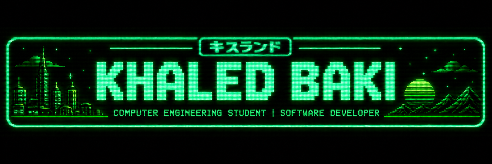
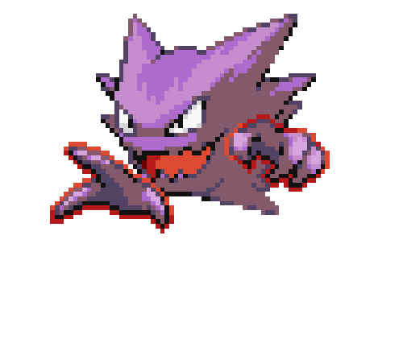
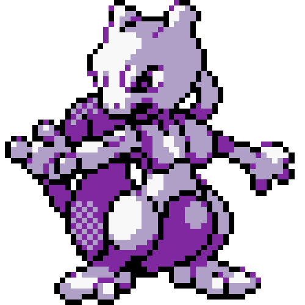

<p align="center">
  
</p>

<p align="center">
  
</p>

<p align="center">
  
</p>

### 👨‍💻 About Me

- 🎓 Computer Engineering student at the University of Ottawa
- 🎵 I play the violin and the guitar(Acoustic & Electric), and I listen to all sorts of music 
- 📖 I Spend most my time studying, and try to learn new code each day

---

### 🌐 Connect With Me

<p align="left">
  <a href="https://www.linkedin.com/in/khaled-abdul-baki" target="_blank">
    
  </a>
  <a href="https://leetcode.com/u/khaleddbaki/" target="_blank">
    
  </a>
</p>

---

### 🛠️ Tech Stack


---

### 🚀 Current Focus

```text
💻 Practicing Data Structures & Algorithms (ITI 1121)
🎧 Building AudioAlchemy — React frontend + Spring Boot backend for AI music generation
📱 Android app development (SEG2105 labs)
🗄️ Database design with SQL / SQLite
```

---

### 📊 GitHub Stats

<p align="center">
  
  
</p>

<p align="center">
  
</p>

---

### 🏆 Trophies

<p align="center">
  
</p>

---

### 🐍 Contribution Snake

<p align="center">
  <picture>
    <source media="(prefers-color-scheme: dark)" srcset="https://raw.githubusercontent.com/KhaledBaki/KhaledBaki/output/github-contribution-grid-snake-dark.svg" />
    <source media="(prefers-color-scheme: light)" srcset="https://raw.githubusercontent.com/KhaledBaki/KhaledBaki/output/github-contribution-grid-snake.svg" />
    
  </picture>
</p>

---

<p align="center">
  
</p>
<p align="center">
  
  
  
</p>
